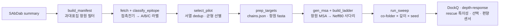

# 항원 MSA 깊이 편향의 진단과 depth-response 기반 항체–항원 도킹 pose 선택

> **SNU BK21 여름 학부연구 2026** · 이창한 교수 항체·면역학 연구실
> 항원 MSA(정렬 깊이)가 딥러닝 도킹 모델을 흔한(과대표집) 에피토프로 편향시키는지 진단하고,
> 그 편향을 **MSA 깊이 반응(depth-response)**으로 되돌려 신규·비면역우세 에피토프 항체의 pose를 건진다.

---

## 한눈에

- **문제** — AlphaFold3 계열 co-folder는 항체–항원 도킹에서 공개 구조에 **흔히 관측된(면역우세) 에피토프로 예측을 끌어당긴다**(학습 편향). 그 자리 밖에 붙는 항체(신규·광범위 중화)일수록 더 틀린다.
- **가설** — 이 편향의 상당 부분이 **항원 MSA 깊이**를 통해 전달된다. MSA를 낮추면 편향이 풀려 off-site 항체의 정답 pose가 되살아난다.
- **접근** — 항원 MSA 깊이를 full → single-sequence로 훑고(**Neff80**로 정규화), 그 반응을 **(a) 편향 진단**, **(b) pose 선택 신호**로 쓴다.
- **정직한 위치** — 방법(MSA subsampling·재랭커)은 이미 선점됨. 본 연구의 기여는 새 알고리즘이 아니라 **depth-response를 항체–항원 도킹의 선택·진단 신호로 결합·적용**하고 **wet 검증 루프**로 잇는 데 있다.

## 가설

| | 내용 |
|---|---|
| **H1** | 항원 MSA 깊이가 예측을 과대표집 에피토프로 편향시킨다 (존재·인과) |
| **H2** | off-site 항체에서 MSA를 낮추면 near-native pose가 되살아난다 (rescue) |
| **H3** | 편향 완화와 pose 품질을 동시에 만족하는 최적 깊이가 존재한다 (표적별) |
| **H4** | 깊이 반응은 정답을 몰라도 편향 취약성·정답 pose를 예측하는 신호다 |

## 데이터셋 — 3그룹 설계 (leakage-free, 2023-06 이후)

같은 과대표집 항원 **안에서** 붙는 위치만 바꿔 confound를 통제한다.

| 그룹 | 역할 | 정의 | MSA 깊이를 낮추면 (예상) |
|---|---|---|---|
| **A** | 역대조 (방향 확인) | 과대표집 항원 + 항체가 **흔한 자리**(지배부위)에 결합 | **오히려 나빠짐** |
| **B** | 실험군 (주효과) | 같은 과대표집 항원 + 항체가 **흔한 자리 밖**(off-site)에 결합 | **정답을 맞히기 시작** |
| **C** | 음성 대조 | **비과대표집** 항원 (편향 줄 prior 없음) | **변화 없음** |

지배부위 라벨(공개 구조 빈도와 독립): RBD=RBM/ACE2·Barnes class, HA=head vs stem, HIV Env=bnAb supersite.
현재 파일럿 = **49 복합체** (RBD·HA·Env 각 A/B + C 9종 재활용). 통계 일반화가 아닌 **메커니즘 입증(case study)**.

## 파이프라인



**생성 모델** — MSA co-folder: **Boltz-2 · Chai-1 · Protenix-base**(2021-09) + 물리: **HADDOCK · SnugDock**(MSA 미사용, decorrelated 생성기).
**깊이 축** — full → **single-seq**, **Neff80**(80% identity 기준 잔기별 유효서열 수의 median) 기준 **geomspace 12단**(로그균등 → 얕은 구간 촘촘, sweet spot 해상도↑). single-seq(편향 완전제거 극단점)는 Chai(PLM 내장)·Protenix가 실행하고, Boltz만 데이터로더 폭주로 skip(`MIN_MSA`).
**지표** — merged-chain DockQ(3-tier 0.23/0.49/0.80) · epitope recall · over-representation overlap · 항체 내부 CA-RMSD.

## Quickstart (서버)

> 코드 = 이 레포 / 대용량(구조·MSA·pose) = `/mnt/data/admuser/msadepth/` (`run_sweep.sh`의 `DATA` 환경변수).

```bash
cd ~/projects && git clone https://github.com/Feellived/bk21-msa-depth-bias.git
cd bk21-msa-depth-bias/pipeline        # 스크립트·매니페스트가 여기 (기본 경로로 동작)
conda activate boltz                   # biopython 필요

# 준비 (GPU 불필요) — A/B·C 49개 전부 이 레포 안에서 처리(자기완결)
python fetch_structures.py --manifest pilot_lean_full.csv --outdir structures
python prep_targets.py    --csv pilot_lean_full.csv --struct structures --outdir targets

# MSA + Neff80 사다리 — 먼저 한 타깃 스모크 → 전체
ONLY=8q7s_O bash gen_msa.sh
bash gen_msa.sh

# 생성 (GPU) — 시간-박스 청크, self-heal 재개
SMOKE=1 bash run_sweep.sh boltz 1      # 타이밍 스모크
bash run_sweep.sh boltz 11             # 밤샘 / 54 = 주말

# 채점 (CPU, 생성과 병렬 — 복합체 끝나는 대로 흘려보내며 채점)
python dockq_sweep.py --models boltz protenix   # → results/dockq_sweep.csv (Neff80 · best DockQ)
```

환경·설치 = [`requirements.md`](requirements.md) (env별 패키지·DockQ 설치).

자세한 서버 실행 흐름 = [`pipeline/README.md`](pipeline/README.md) · 데이터 획득·저장(provenance) = [`pipeline/DATA.md`](pipeline/DATA.md).
원천 데이터(SAbDab summary) 다운로드 = `bash pipeline/fetch_sabdab.sh` (구조는 `fetch_structures.py`가 RCSB에서). 대용량은 `/mnt/data` 권장(홈 디스크 보호).

## 레포 구조

```
├── README.md                 이 문서
├── plan/research_plan.md      연구 계획서(배경·가설·방법·예상결과·참고문헌)
├── pipeline/                  depth-sweep 본체 (스크립트 + 매니페스트 동거, 여기서 실행)
│   ├── build_manifest·classify_epitope·select_pilot   데이터셋 구축
│   ├── prep_targets·gen_msa·build_ladder·make_input    입력·MSA·사다리
│   ├── run_sweep.sh                                    시간-박스 dispatcher
│   └── *.csv (pilot_lean_full·sweep_targets 등)        확정 세트 매니페스트
└── report/                    보고서 · 그림 (작업 중)
```

## 상태

- [x] 데이터셋 설계·검증·lock (49 복합체, A/B·C 전부 self-contained) · 에피토프 분류기 6/6 참조 검증
- [x] Neff80 사다리 빌더 · 생성 dispatcher(시간-박스 재개형) · 입력 생성기(다사슬 항원)
- [x] DockQ 채점기(`dockq_sweep.py`) · 환경 문서(`requirements.md`)
- [ ] 전체 depth-sweep 생성 (Boltz → Protenix → Chai, 청크)
- [ ] depth-response 분석 (그룹별 깊이–DockQ 곡선·rescue·선택·편향센서) — `analyze_depth.py` 추후
- [ ] Chai 러너 · 물리 생성기(HADDOCK·SnugDock) · wet 검증 루프

## 선행연구 · 정직한 위치

방법 요소는 모두 선점되어 있으며 인용·활용한다. 기여는 **결합·적용 + wet 루프**.

- **학습 편향** — Guan & Keating 2025 (Protein Science): AF/Boltz/Chai가 학습 계면을 암기, 신뢰도로 정답 못 가름.
- **MSA 깊이 → 구조 분포** — del Alamo 2022 (eLife) · Monteiro da Silva 2024 (Nat Commun): MSA 깊이가 출력 conformation을 지배(단, 대안구조 다양성 목적).
- **항체–항원 MSA 무용** — McCoy 2024 (Protein Science): 항체–항원에서 Neff–DockQ 상관 없음, 흔한 계면 기하로 편향.
- **재랭킹** — DeepRank-Ab 2026 · ARID-sf 2026 · pDockQ2 · ipSAE (사후 단일구조 채점).
- **깊이 지표** — NEFFy (Rajabi 2026): Neff 정규화.

전체 참고문헌 = [`plan/research_plan.md`](plan/research_plan.md) §참고문헌.
